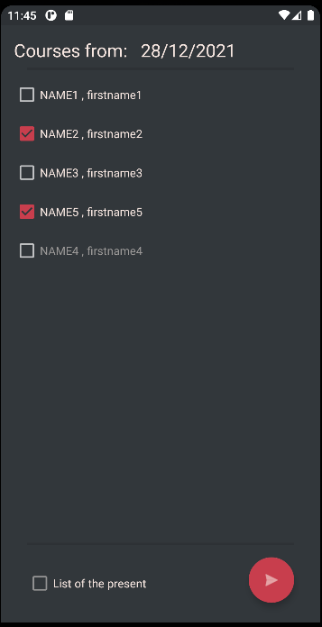
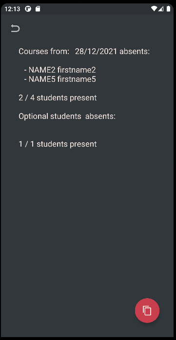

# Android Application with Kotlin to easily see who's present and absent 

The application generates a text with the information you can simply copy it and then you do whatever you want with it 
To set the list of the thing you want, you need to go in the code to `app/java/com.example.tutoratcall/database/DatabaseManager.kt`
`line 38` in function `init` you set the list you want I already put an example to see how it's work and then launch 
*if you have already launched once you need to add + 1 to the number of the version. 
Then go at the end of the file and modify the constant `DATABASE_VERSION`* 

For now, only 2 languages are handled `French` and `English`

The primary display is : 

You simply select the absents and then click the button to go to the next step.
Or you can reverse the operation by selecting the checkbox on the bottom and then you select the presents persons 

Once you go to the next step you should see something like this :

You see a text with the information you want. You can copy it to the clipboard with the red button 